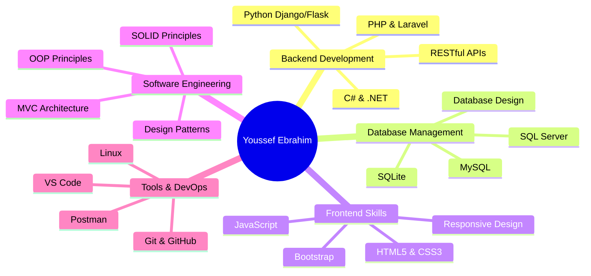

<div align="center">

<!-- Animated Header with Gradient -->


<!-- Dynamic Typing Animation -->
<a href="https://git.io/typing-svg">
  
</a>

<br/>

<!-- Animated Profile Views & Social Badges -->
<p align="center">
  
  
  
</p>

<!-- Social Media Buttons with Hover Animation -->
<p align="center">
  <a href="https://www.youtube.com/@Eng.Joe9">
    
  </a>
  <a href="https://www.linkedin.com/in/youssefebrahim-7a183a263">
    
  </a>
  <a href="mailto:yuossefebrahem211@gmail.com">
    
  </a>
  <a href="tel:+201027996547">
    
  </a>
</p>

</div>

---

##  About Me

```typescript
class YoussefEbrahim {
    // Personal Info
    readonly name = "Youssef Ebrahim Mostafa";
    readonly role = "Software Engineer | Backend Developer";
    readonly location = "Giza, Egypt 🇪🇬";
    readonly phone = "+20 1027996547";
    
    // Education
    education = {
        degree: "Bachelor of Computer & Systems Engineering",
        university: "Helwan University",
        graduation: 2027,
        gpa: "Excellent (86.57%)",
        currentLevel: "Junior (3rd Year)"
    };
    
    // Technical Arsenal
    techStack = {
        backend: ["PHP", "Laravel", "C#", ".NET", "Python", "Django", "Flask"],
        frontend: ["HTML5", "CSS3", "JavaScript", "Bootstrap", "Blade", "Twig"],
        database: ["MySQL", "SQLite", "SQL Server"],
        tools: ["Git", "GitHub", "Postman", "VS Code", "Linux"],
        concepts: ["OOP", "MVC", "REST API", "System Architecture", "SOLID Principles"]
    };
    
    // Current Status
    currentlyWorkingOn = [
        "🚀 Freelance Backend Projects (6+ delivered)",
        "🎓 Full-Stack .NET Development @ DEPI",
        "💡 Building MaestroMart & Wbridge platforms",
        "🎥 Creating educational content on YouTube"
    ];
    
    // Fun Facts
    funFacts = {
        languages: { arabic: "Native", english: "Excellent" },
        motivation: "Turning requirements into reality ☕💻",
        passion: "Building scalable, maintainable systems",
        goal: "Seeking mentorship & innovative collaborations"
    };
    
    // Contact Methods
    getInTouch = () => ({
        email: "yuossefebrahem211@gmail.com",
        linkedin: "linkedin.com/in/youssefebrahim-7a183a263",
        youtube: "youtube.com/@Eng.Joe9",
        availability: "Open for opportunities! 📩"
    });
}

const engineer = new YoussefEbrahim();
console.log("🌟 Let's build something amazing together!");
```

<div align="center">

### 🎯 **Current Focus** 

<table>
  <tr>
    <td align="center" width="33%">
      
      <br/><strong>Backend Development</strong>
      <br/>Laravel • .NET • Django
    </td>
    <td align="center" width="33%">
      
      <br/><strong>Full-Stack Training</strong>
      <br/>DEPI • ITI Programs
    </td>
    <td align="center" width="33%">
      
      <br/><strong>Content Creation</strong>
      <br/>Educational Programming
    </td>
  </tr>
</table>

</div>

---

##  Tech Stack

<div align="center">

### 💻 Languages & Frameworks

<table>
  <tr>
    <td align="center" width="100">
      
      <br><strong>PHP</strong>
    </td>
    <td align="center" width="100">
      
      <br><strong>C#</strong>
    </td>
    <td align="center" width="100">
      
      <br><strong>Python</strong>
    </td>
    <td align="center" width="100">
      
      <br><strong>Java</strong>
    </td>
    <td align="center" width="100">
      
      <br><strong>C++</strong>
    </td>
    <td align="center" width="100">
      
      <br><strong>JavaScript</strong>
    </td>
  </tr>
</table>

### 🛠️ Backend Technologies


### 🎨 Frontend & Styling


### 🗄️ Database & Storage

<table>
  <tr>
    <td align="center" width="100">
      
      <br><strong>MySQL</strong>
    </td>
    <td align="center" width="100">
      
      <br><strong>SQLite</strong>
    </td>
    <td align="center" width="100">
      
      <br><strong>SQL Server</strong>
    </td>
  </tr>
</table>

### ⚙️ DevOps & Tools


### 📚 Core Concepts


</div>

---

## 🚀 Featured Projects

<div align="center">

### 🏆 Live Production Projects

</div>

<table>
<tr>
<td width="50%" valign="top">

### 🛒 **MaestroMart**
[](https://maestromartv2.al-barbari.com)
[](https://maestromartv2.al-barbari.com)
[](https://maestromartv2.al-barbari.com)

**Comprehensive Warehouse Management System**  
*Apr - May 2025*

A robust inventory and sales management platform designed for supermarkets and wholesalers with real-time tracking capabilities.

**🎯 Key Features:**
- ✅ Advanced inventory management
- ✅ Real-time stock tracking & alerts
- ✅ Sales analytics & reporting dashboard
- ✅ Multi-user role-based access control
- ✅ Invoice generation & management
- ✅ Supplier & customer management
- ✅ Barcode integration support

**🔗 [Live Demo](https://maestromartv2.al-barbari.com)**  
**🔑 Credentials:** `admin@admin.com` / `admin`

**💡 Tech Highlights:**
- RESTful API architecture
- Secure authentication system
- Optimized database queries
- Responsive dashboard design

</td>
<td width="50%" valign="top">

### 🌍 **Wbridge**
[](https://w-bridge.org)
[](https://w-bridge.org)
[](https://w-bridge.org)

**International Shopping Platform**  
*Feb - May 2025*

Revolutionary real-time platform connecting product buyers with international travelers for seamless cross-border shopping experiences.

**🎯 Key Features:**
- ✅ Smart matching algorithm (Buyer ↔️ Traveler)
- ✅ Real-time notification system
- ✅ Secure user authentication & verification
- ✅ Product request management
- ✅ Transaction tracking & escrow
- ✅ Rating & review system
- ✅ Multi-currency support

**🔗 [Live Demo](https://w-bridge.org)**

**💡 Tech Highlights:**
- Real-time data synchronization
- Geolocation integration
- Secure payment gateway ready
- Mobile-responsive interface
- Advanced search & filtering

</td>
</tr>
<tr>
<td width="50%" valign="top">

### 📊 **Sales Management System**


**Desktop Application for Sales Operations**

Collaborative team project for comprehensive sales, inventory, and invoice management with efficient data structures.

**🎯 Key Features:**
- ✅ Complete CRUD operations
- ✅ Inventory tracking & alerts
- ✅ Automated invoice generation
- ✅ Sales analytics & reports
- ✅ Multi-user access levels
- ✅ Data persistence & backup

**💡 Tech Highlights:**
- Object-oriented design
- File-based database
- Efficient algorithms
- Clean architecture

</td>
<td width="50%" valign="top">

### 💬 **JavaFX Chat Application**


**Real-Time Messaging System**

Fully-featured chat application with modern UI design and database integration for message persistence.

**🎯 Key Features:**
- ✅ User authentication & authorization
- ✅ Real-time messaging
- ✅ Message history & search
- ✅ Online/offline status
- ✅ Group chat support
- ✅ File sharing capability

**💡 Tech Highlights:**
- Socket programming
- Multi-threading
- MVC architecture
- Modern JavaFX UI

</td>
</tr>
<tr>
<td colspan="2" align="center">

### 🔧 **More Projects Coming Soon...**

Currently working on exciting new projects in Laravel, .NET, and Python. Stay tuned! 🚀

</td>
</tr>
</table>

---

## 💼 Professional Experience

<div align="center">

<table>
<tr>
<td width="33%" align="center">

### 💻 Freelance Backend Developer
**Dec 2024 - Present** | Remote


✅ **4+** Laravel Projects  
✅ **2+** Frontend Projects  
✅ **100%** Client Satisfaction  
✅ Scalable & Maintainable Code

**Key Achievements:**
- Built production-ready applications
- Implemented secure authentication
- Optimized database performance
- Delivered on time & within budget

</td>
<td width="33%" align="center">

### 🎓 DEPI Training
**Jun 2025 - Present**


**Full Stack .NET Development**  
*Ministry of Communications & IT*

**Learning:**
- ASP.NET Core MVC
- Entity Framework Core
- SQL Server
- RESTful APIs
- Modern Web Development

</td>
<td width="33%" align="center">

### 🏢 ITI Training
**Aug - Sep 2025**


**Multi-Track Training**

✅ **.NET Web Development** (Sep 2025)  
✅ **Django & Flask** (Aug 2025)

**Skills Gained:**
- Full-stack development
- Python frameworks
- Database management
- Version control

</td>
</tr>
<tr>
<td width="33%" align="center">

### 🔐 WE INNOVATE
**Aug - Sep 2024**


**GRC Cybersecurity Bootcamp**

**Focus Areas:**
- Governance frameworks
- Risk assessment
- Compliance standards
- Security policies
- Incident response

</td>
<td width="33%" align="center">

### 🏛️ Helwan University
**Jun - Jul 2024**


**Summer Training Program**

**Topics Covered:**
- Software fundamentals
- System architecture
- Design patterns
- Best practices
- Team collaboration

</td>
<td width="33%" align="center">

### 🎥 Content Creator
**Ongoing**


**YouTube Channel: Eng.Joe9**

**Creating:**
- Programming tutorials
- Code walkthroughs
- Tech tips & tricks
- Project showcases
- Learning resources

</td>
</tr>
</table>

</div>

---

## 📊 GitHub Statistics

<div align="center">


</div>

### 🔥 Contribution Heatmap

<div align="center">
  


</div>

---

## 🏆 Achievements & Trophies

<div align="center">


### 📈 Current Streak Status

<table>
  <tr>
    <td align="center">
      
      <br/><strong>Delivered</strong>
    </td>
    <td align="center">
      
      <br/><strong>Satisfied Clients</strong>
    </td>
    <td align="center">
      
      <br/><strong>Mastered</strong>
    </td>
    <td align="center">
      
      <br/><strong>In Arsenal</strong>
    </td>
  </tr>
</table>

</div>

---

## 🎓 Certifications & Education

<div align="center">

### 📜 Professional Training & Certifications

<table>
<tr>
<th width="40%">Program</th>
<th width="30%">Organization</th>
<th width="15%">Duration</th>
<th width="15%">Status</th>
</tr>
<tr>
<td>
  
  <strong>Full Stack .NET Development</strong>
</td>
<td>DEPI (Ministry of Communications & IT)</td>
<td>Jun 2025 - Present</td>
<td></td>
</tr>
<tr>
<td>
  
  <strong>.NET Web Development</strong>
</td>
<td>Information Technology Institute (ITI)</td>
<td>Sep 2025</td>
<td></td>
</tr>
<tr>
<td>
  
  <strong>Django & Flask Development</strong>
</td>
<td>Information Technology Institute (ITI)</td>
<td>Aug 2025</td>
<td></td>
</tr>
<tr>
<td>
  
  <strong>GRC Cybersecurity Bootcamp</strong>
</td>
<td>WE INNOVATE</td>
<td>Aug - Sep 2024</td>
<td></td>
</tr>
<tr>
<td>
  
  <strong>Software Fundamentals Training</strong>
</td>
<td>Helwan University</td>
<td>Jun - Jul 2024</td>
<td></td>
</tr>
<tr>
<td>
  
  <strong>Web Development Fundamentals</strong>
</td>
<td>SprintUp</td>
<td>Certified</td>
<td></td>
</tr>
</table>

### 🎓 Academic Background

<table>
<tr>
<th>Degree</th>
<th>Institution</th>
<th>Period</th>
<th>Grade</th>
</tr>
<tr>
<td><strong>Bachelor of Computer & Systems Engineering</strong></td>
<td>Helwan University, Faculty of Engineering</td>
<td>Oct 2022 - Jun 2027 (Expected)</td>
<td><strong>Excellent (86.57%)</strong></td>
</tr>
<tr>
<td><strong>High School - Thanaweya Amma</strong></td>
<td>Saidia Military Secondary School for Boys</td>
<td>Sep 2018 - Jun 2022</td>
<td><strong>Graduated</strong></td>
</tr>
</table>

</div>

---

## 💪 Core Competencies & Skills

<div align="center">

### 🎯 Technical Expertise

<table>
<tr>
<td width="25%" align="center">

<br/><strong>Backend Development</strong>
<br/>
<code>Laravel</code> <code>.NET</code>
<br/>
<code>Django</code> <code>Flask</code>
</td>
<td width="25%" align="center">

<br/><strong>Database Design</strong>
<br/>
<code>MySQL</code> <code>SQLite</code>
<br/>
<code>SQL Server</code> <code>ER Modeling</code>
</td>
<td width="25%" align="center">

<br/><strong>System Architecture</strong>
<br/>
<code>MVC</code> <code>REST API</code>
<br/>
<code>Design Patterns</code> <code>SOLID</code>
</td>
<td width="25%" align="center">

<br/><strong>Version Control</strong>
<br/>
<code>Git</code> <code>GitHub</code>
<br/>
<code>Collaboration</code> <code>CI/CD</code>
</td>
</tr>
</table>

### 🌟 Soft Skills & Qualities

<table>
<tr>
<td align="center" width="20%">

<br/><strong>Teamwork</strong>
<br/>
<sub>Collaborative Spirit</sub>
</td>
<td align="center" width="20%">

<br/><strong>Leadership</strong>
<br/>
<sub>Project Management</sub>
</td>
<td align="center" width="20%">

<br/><strong>Problem Solving</strong>
<br/>
<sub>Critical Thinking</sub>
</td>
<td align="center" width="20%">

<br/><strong>Fast Learning</strong>
<br/>
<sub>Adaptability</sub>
</td>
<td align="center" width="20%">

<br/><strong>Communication</strong>
<br/>
<sub>Clear & Effective</sub>
</td>
</tr>
</table>

### 📚 Knowledge Areas



</div>

---

## 🎨 Skills Visualization

<div align="center">

### 💻 Programming Proficiency


### 📊 Skill Level Distribution

```text
Backend Development  ████████████████████  100%
Laravel Framework    ███████████████████   95%
.NET Development     ██████████████████    90%
Python Web Frameworks███████████████████   95%
Database Management  ███████████████████   95%
Frontend Development ████████████████      80%
System Architecture  ██████████████████    90%
Git & Version Control████████████████████  100%
Problem Solving      ████████████████████  100%
Team Collaboration   ███████████████████   95%
```

</div>

---

## 📈 Coding Activity

<div align="center">

### ⚡ Recent Activity

<!--START_SECTION:activity-->
<!-- This section will be auto-updated by GitHub Actions -->
<!--END_SECTION:activity-->

### 🐍 Contribution Snake Animation

<picture>
  <source media="(prefers-color-scheme: dark)" srcset="https://raw.githubusercontent.com/Eng-Joe/Eng-Joe/output/github-contribution-grid-snake-dark.svg">
  <source media="(prefers-color-scheme: light)" srcset="https://raw.githubusercontent.com/Eng-Joe/Eng-Joe/output/github-contribution-grid-snake.svg">
  
</picture>

</div>

---

## 💡 Random Dev Quote

<div align="center">


</div>

---

## 🎯 Goals & Aspirations

<div align="center">

<table>
<tr>
<td width="33%" align="center">

### 🎓 Short-Term Goals


- ✅ Complete DEPI .NET Training
- 🔄 Master ASP.NET Core
- 🔄 Build 5+ Full-Stack Projects
- 🔄 Contribute to Open Source
- 🔄 Obtain Professional Certifications

</td>
<td width="33%" align="center">

### 🚀 Mid-Term Goals


- 🎯 Land a Backend Developer Role
- 🎯 Master Microservices Architecture
- 🎯 Learn Cloud Technologies (AWS/Azure)
- 🎯 Build Production-Scale Apps
- 🎯 Grow YouTube Channel to 10K+

</td>
<td width="33%" align="center">

### 🌟 Long-Term Goals


- 🏆 Become a Senior Software Engineer
- 🏆 Lead Development Teams
- 🏆 Create Impactful Products
- 🏆 Mentor Junior Developers
- 🏆 Contribute to Tech Community

</td>
</tr>
</table>

</div>

---

## 🤝 Let's Connect & Collaborate!

<div align="center">

 

### 💬 **I'm Open To:**

<table>
<tr>
<td align="center" width="33%">

<br/><strong>💼 Freelance Projects</strong>
<br/>
<sub>Backend Development<br/>Full-Stack Solutions</sub>
</td>
<td align="center" width="33%">

<br/><strong>🤝 Collaboration</strong>
<br/>
<sub>Open Source<br/>Team Projects</sub>
</td>
<td align="center" width="33%">

<br/><strong>🎓 Mentorship</strong>
<br/>
<sub>Learning Opportunities<br/>Knowledge Sharing</sub>
</td>
</tr>
</table>

### 📫 **Get In Touch:**

<a href="https://www.youtube.com/@Eng.Joe9">
  
</a>
<a href="https://www.linkedin.com/in/youssefebrahim-7a183a263">
  
</a>
<a href="mailto:yuossefebrahem211@gmail.com">
  
</a>
<a href="https://wa.me/201027996547">
  
</a>
<a href="tel:+201027996547">
  
</a>

### 📍 **Location:** Giza, Egypt 🇪🇬

### ⏰ **Availability:** Open for opportunities! Ready to start immediately 🚀

<br/>


### 💼 **Topics I Love to Discuss:**

`Backend Architecture` • `System Design` • `Laravel Best Practices` • `.NET Development` • `Database Optimization` • `API Design` • `Code Quality` • `DevOps` • `Tech Trends` • `Career Growth`

<br/>

### 🎯 **Quick Facts:**

<table>
<tr>
<td align="center">📧 <strong>Response Time:</strong> Within 24 hours</td>
<td align="center">🌍 <strong>Time Zone:</strong> EET (UTC+2)</td>
<td align="center">💻 <strong>Work Style:</strong> Remote-Friendly</td>
</tr>
<tr>
<td align="center">🗣️ <strong>Languages:</strong> Arabic (Native), English (Fluent)</td>
<td align="center">🎓 <strong>Learning:</strong> Always exploring new tech</td>
<td align="center">☕ <strong>Powered By:</strong> Coffee & Code</td>
</tr>
</table>

</div>

---

## 🎨 Visitor's Book

<div align="center">

### ✍️ Leave your mark! Drop a message or just say hi! 👋

<a href="https://github.com/Eng-Joe">
  
</a>


### 📊 Profile Statistics

<table align="center">
<tr>
<td align="center">

</td>
<td align="center">

</td>
<td align="center">

</td>
</tr>
</table>

</div>

---

## 🌟 Support My Work

<div align="center">


### If you find my projects helpful, consider:

⭐ **Starring** my repositories  
👁️ **Following** me on GitHub  
🔗 **Connecting** on LinkedIn  
📺 **Subscribing** to my YouTube channel  
💬 **Sharing** my work with others  

<br/>

<table>
<tr>
<td align="center">

<br/>
<strong>Every star ⭐ motivates me<br/>to create better projects!</strong>
</td>
</tr>
</table>

</div>

---

## 📚 Latest Blog Posts & Content

<div align="center">

### 🎥 YouTube Channel: Eng.Joe9

<!-- YOUTUBE:START -->
*Coming Soon: Programming tutorials, project walkthroughs, and tech insights!*
<!-- YOUTUBE:END -->

<a href="https://www.youtube.com/@Eng.Joe9">
  
</a>

</div>

---

## 🎭 Fun Zone

<div align="center">

### 😄 Developer Jokes


### 🎵 Currently Listening To


</div>

---

<div align="center">


### ⚡ **"Building the future, one commit at a time"** ⚡


---

### 🚀 **Current Mission:** Transforming Ideas into Reality

<table>
<tr>
<td align="center">

<br/>
<sub><strong>Code Quality</strong></sub>
</td>
<td align="center">

<br/>
<sub><strong>Best Practices</strong></sub>
</td>
<td align="center">

<br/>
<sub><strong>Innovation</strong></sub>
</td>
<td align="center">

<br/>
<sub><strong>Continuous Learning</strong></sub>
</td>
</tr>
</table>

---


<br/>

**✨ Crafted with 💛 by Youssef Ebrahim (Eng Joe) ✨**

<sub>Last Updated: October 2025</sub>

</div>
